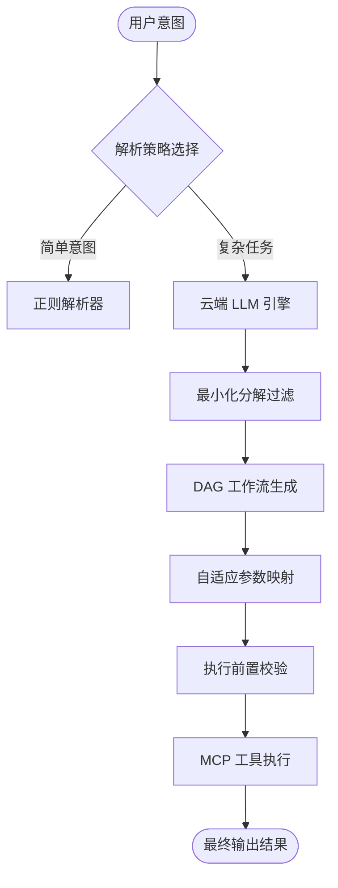

# IntentOrch

[](https://www.npmjs.com/package/@mcpilotx/intentorch)
[](LICENSE)
[](https://www.typescriptlang.org/)


[English](./README.md) | [简体中文]

**IntentOrch** 是一款为 **Model Context Protocol (MCP)** 生态系统量身定制的高性能、意图驱动的编排引擎。它能够将模糊的自然语言指令转化为精确、可执行且具高鲁棒性的工具调用流。

---

## 🚀 为什么选择 IntentOrch?

当前的 LLM 工具调用往往面临两个痛点：“过度分解”（在冗余步骤上浪费 Token）和“参数契约不匹配”（不同 MCP 服务器之间的命名冲突）。IntentOrch 通过专业的编排层完美解决了这些问题。

### 💎 核心价值

- **最小化分解原则 (Minimal Decomposition Principle)**：智能前置分析，确保生成最简执行路径。有效拒绝 LLM 的“过度思考”，大幅降低 Token 损耗和执行延迟。
- **自适应参数映射 (Adaptive Parameter Mapping)**：基于语义的参数对齐引擎。自动桥接 LLM 推理结果与异构 MCP 工具 Schema 之间的鸿沟（例如：自动将 `filename` 映射为 `path`）。
- **鲁棒性 DAG 引擎**：基于有向无环图 (DAG) 的任务执行模型，内置拓扑排序、依赖分析和多级错误恢复机制。
- **混合意图解析架构**：结合超快速的正则启发式逻辑与深度 LLM 推理，实现性能与精准度的最优平衡。

---

## 📦 安装

```bash
npm install @mcpilotx/intentorch
```

---

## ⚡ 快速上手

仅需数行代码，即可实现跨工具的复杂意图编排。

```typescript
import { createSDK } from '@mcpilotx/intentorch';

const sdk = createSDK();

// 1. 配置您的 AI 大模型（支持 DeepSeek, OpenAI, Ollama 等）
await sdk.configureAI({
  provider: 'deepseek', 
  apiKey: process.env.DEEPSEEK_API_KEY,
  model: 'deepseek-chat'
});

// 2. 连接多个 MCP 服务器
await sdk.connectMCPServer({
  name: 'github',
  transport: { type: 'stdio', command: 'npx', args: ['-y', '@modelcontextprotocol/server-github'] }
});

await sdk.connectMCPServer({
  name: 'dingtalk', // 钉钉通知
  transport: { type: 'stdio', command: 'npx', args: ['-y', 'mcp-server-dingtalk'] }
});

// 3. 初始化 CloudIntentEngine
await sdk.initCloudIntentEngine();

// 4. 执行复杂意图编排
const result = await sdk.executeWorkflowWithTracking(
  "分析 mcpilotx/intentorch 仓库的最新 PR，并生成一份报告通过钉钉发送给开发群"
);

console.log('工作流执行结果:', result.success);
```

---

## 🛠 架构概览

IntentOrch 作为智能中间件，位于您的应用与 MCP 生态系统之间：



---

## 🌟 进阶特性

### 🧩 交互式反馈
当系统对意图解析的置信度较低时，IntentOrch 会自动暂停并请求用户确认，确保高风险操作的安全性。

### 📝 @intentorch 指令系统
支持在自然语言中通过指令直接干预编排逻辑：
- `查询日志 @intentorch summary` -> 自动在工作流末尾追加一个 AI 摘要生成步骤。

### 🛡️ 生产级保障
内置 `RetryManager`（重试管理）、`FallbackManager`（降级管理）和 `PerformanceMonitor`（性能监控），确保您的 AI 工作流具备生产级的稳定性。

---

## 📄 许可证

基于 Apache-2.0 许可证。详见 [LICENSE](LICENSE)。

---

## 🤝 参与贡献

我们非常欢迎社区贡献！如有任何想法或建议，请提交 Pull Request。

---

由 **MCPilotX** 倾心打造 ❤️
